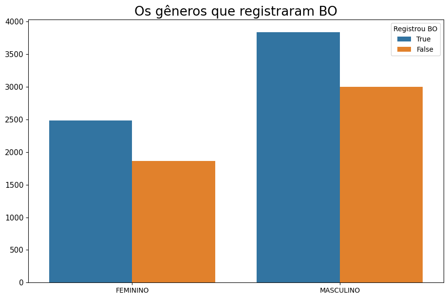
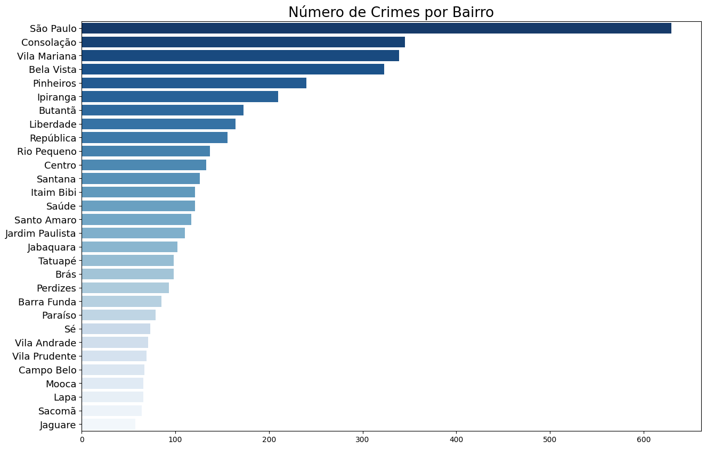

# 🔫 Análise de Crimes - Dataset de Ocorrências

Este repositório contém um conjunto de códigos para análise e visualização de um dataset relacionado a crimes. O objetivo principal é explorar as informações sobre os crimes registrados, como o número de ocorrências por gênero, bairro, e outras variáveis.

## 📌 Bibliotecas Utilizadas

O código utiliza as seguintes bibliotecas:

- **pandas**: Para manipulação e análise de dados.
- **matplotlib**: Para criação de gráficos e visualizações.
- **seaborn**: Para gráficos estatísticos mais avançados.
- **numpy**: Para operações matemáticas.
- **wordcloud**: Para criar nuvens de palavras com base na descrição dos crimes.

## 🔖 Passos do Código

1. **Carregamento e Visualização Inicial**:
   - Carregamento do dataset de crimes a partir de uma URL (CSV) usando `pandas.read_csv()`.
   - Exibição das primeiras linhas do dataset com `df.head()`.
   - Análise de informações gerais sobre o dataset com `df.info()`.

2. **Limpeza de Dados**:
   - Atribuição de valores para a coluna 'sexo' (convertendo 1 para "MASCULINO" e 0 para "FEMININO").
   - Preenchimento de valores nulos nas colunas relacionadas a itens de crime com `False` usando `fillna()` e conversão para tipo `str`.
   - Remoção de registros com valores nulos em algumas colunas específicas.
   
3. **Análise Descritiva**:
   - Exibição de estatísticas descritivas dos dados numéricos com `df.describe()`.
   - Análise de variáveis categóricas (como 'sexo' e 'registrou_bo').

4. **Visualizações**:
   - Gráficos de **distribuição de gênero** das vítimas de crimes com um gráfico de pizza.
   - Gráficos de **frequência de boletins de ocorrência (BO)** registrados.
   - **Gráficos de barras** para mostrar o número de crimes por bairro.
   - **Distribuição de prejuízos**: Gráficos de caixa e violino para comparar o valor do prejuízo entre os sexos.
   - **Word Cloud**: Nuvem de palavras das descrições dos crimes para visualizar os termos mais frequentes.

5. **Análise Temporal**:
   - Análise do número de crimes **por ano**, **mês**, **dia do mês** e **dia da semana**.
   - Criação de gráficos de barras para mostrar tendências ao longo do tempo.

6. **Visualização Avançada**:
   - **Gráficos de barras** para exibir o número de crimes por bairro.
   - Exibição de **estatísticas de prejuízo** por gênero e registros de BO.

## 💻 Como Usar

1. **Requisitos**:
   - Instale as dependências necessárias usando:
     ```bash
     pip install pandas matplotlib seaborn numpy wordcloud
     ```

2. **Carregamento do Dataset**:
   - O dataset é carregado diretamente de uma URL:
     ```python
     df = pd.read_csv('https://www.dropbox.com/s/ghgb8xggbhgyuk3/dataset-limpo.csv?dl=1', parse_dates=['time'])
     ```

3. **Execução**:
   - Execute os blocos de código para gerar as visualizações e realizar as análises descritas.
   - Utilize funções como `sns.countplot()`, `plt.pie()`, `sns.barplot()` para visualizar os dados.

## 📈 Exemplo de Visualizações

### Gráfico de Distribuição de Gênero:



### Gráfico de Crimes por Bairro:



## 📄 Licença

Este projeto foi desenvolvido apenas para fins de aprendizagem e analida exploratória
